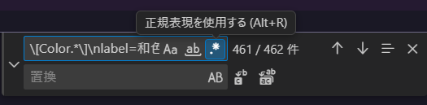
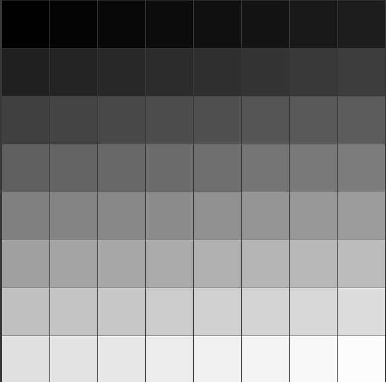
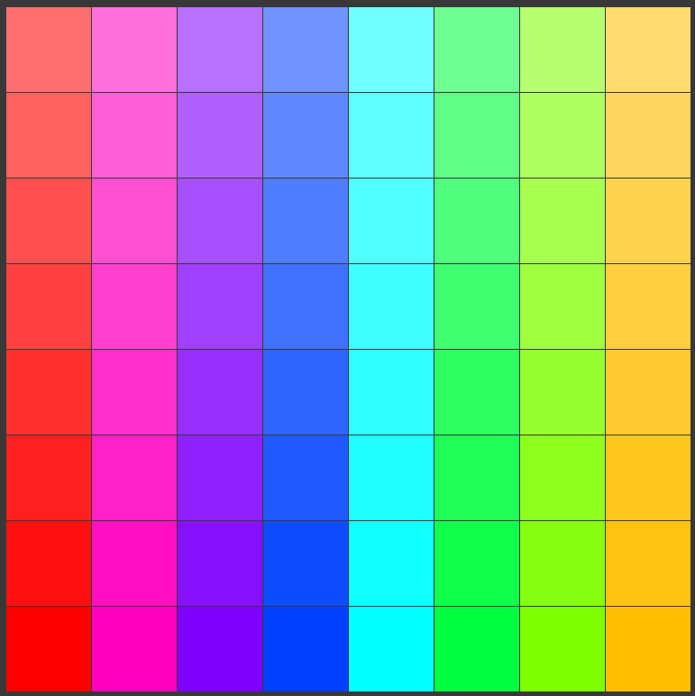
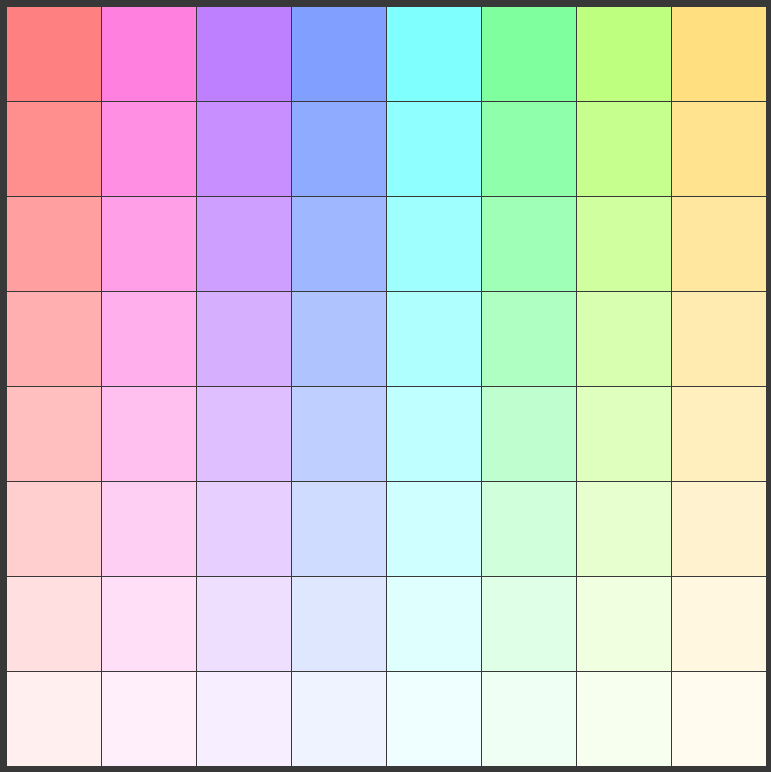
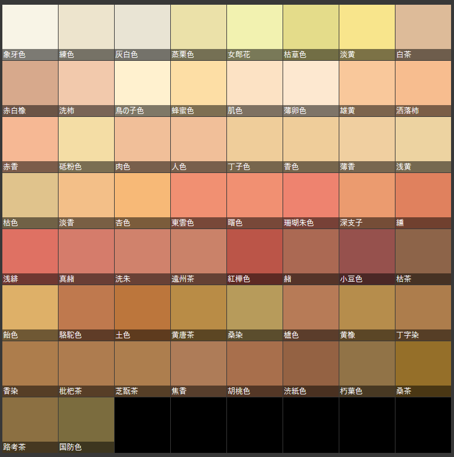
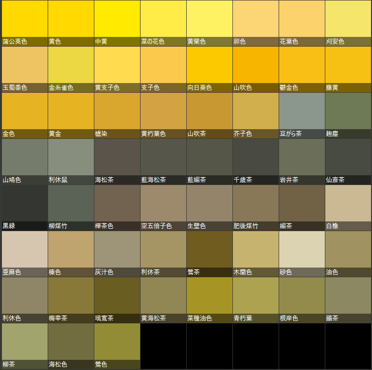

# AviUtl2用　カラーパレット
> [!CAUTION]
> 和色カラーパレットを導入する際は、**ファイルを追加してからAviUtl2を起動する前に**アプリケーションデータフォルダ
> (`ProgramData > AviUtl2`または`AviUtl2.exe`と同階層にあるDataフォルダ)のなかにある
> `aviutl2.ini`の末尾に[このファイル](./このファイルの内容をアプリケーションデータフォルダ内のaviutl2.iniの末尾に追記してください)
の中身を全部コピペして追記してください。(もとの設定を上書きしないように注意してください。)
> 
> これを行わないと、プリセット色メニューに大量の色が追加されてしまい、色選択が不便になります。
  <details>
  <summary>設定を忘れてしまった方向けの対処法</summary><br>
    aviutl2.iniをVSCodeなどのテキストエディタで開き、AviUtl2を終了する際に自動で追加された部分を削除します。<br>
    VSCodeの場合は、Ctrl+Hで開く置換メニューに以下のように記入し、「正規表現を使用する」モードになっていることを確認し、
    右下にある「すべて置換」ボタンを押すことで削除してから
    <a href="./このファイルの内容をアプリケーションデータフォルダ内のaviutl2.iniの末尾に追記してください">上記のファイル</a>の内容を追記してください。
    <br>

    \[Color.*\]\nlabel=和色.*\n.*\n.*\n
    
  </details>

## 含まれるカラーパレット
- モノトーン (黒～白)
  <br>
- ビビッドカラー (HSVでV=100, S>50の色)
  <br>
- パステルカラー (HSVでV=100, S≦50の色)
  <br>
- [和色大辞典](https://www.colordic.org/w)に掲載されている全495色 (8分割されています)
  <br>
  <br>
  
(洋色など別のカラーパレットも時間が空き次第追加するつもりです)

## 導入方法
1. アプリケーションデータフォルダ内の`Default`フォルダに追加したいカラーパレットの`.pallete`ファイルを配置します。
2. アプリケーションデータフォルダにある`aviutl2.ini`の末尾に
   [このファイル](./このファイルの内容をアプリケーションデータフォルダ内のaviutl2.iniの末尾に追記してください)
   の中身を全部コピペして追記してください。この際もとの設定を消してしまわないように気をつけてください。
3. AviUtl2を開くと、色設定ウィンドウ右上の🔃ボタンからカラーパレットが変更できるはずです🎉

---
### [AviUtl2 アクセスキー付き日本語](https://github.com/Garech-mas/jp_akey.aul2)(Garech-mas様作)を使っている人向け 便利な設定
アプリケーションデータフォルダにある`Language`フォルダの中の`日本語(アクセスキー付き).aul2`の適当な位置\
(`; ★左クリック：色設定ウィンドウ 「パレットを切り替え」アイコン（タイトルバーの右端）`の次の行など)\
に以下のコードをコピペして追記することで、より色選択がやりやすくなります。
```
モノトーン=モノトーン (&M)
ビビッド (V＝100,S＞50)=ビビッド (V＝100,S＞50) (&V)
パステル (V＝100,S≦50)=パステル (V＝100,S≦50) (&P)
和色=和色 (&W)
⬜️桃　～🟥赤　=⬜️桃　～🟥赤　 (&1)
⬜️白　～⬛️茶黒=⬜️白　～⬛️茶黒 (&2)
🟦水　～⬛️黒　=🟦水　～⬛️黒　 (&3)
🟦紺　～🟪紫　=🟦紺　～🟪紫　 (&4)
🟧橙　～🟥赤茶=🟧橙　～🟥赤茶 (&5)
🟨薄黄～🟫薄茶=🟨薄黄～🟫薄茶 (&6)
🟨黄　～🟫茶　=🟨黄　～🟫茶　 (&7)
🟨黄緑～🟩青緑=🟨黄緑～🟩青緑 (&8)
```
